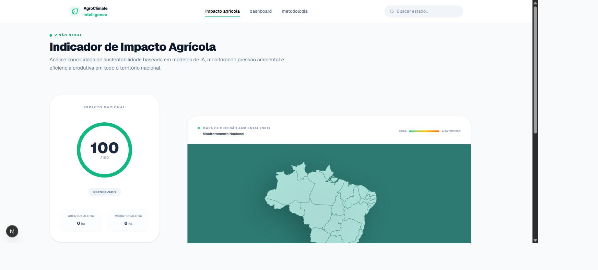
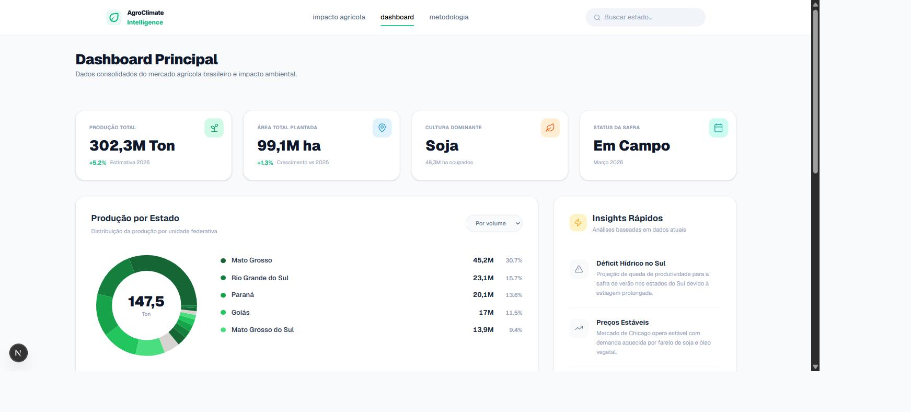
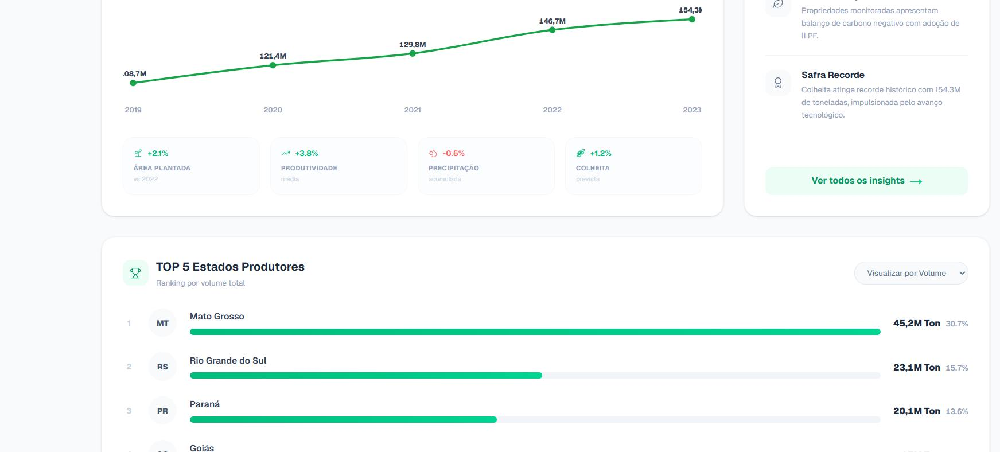
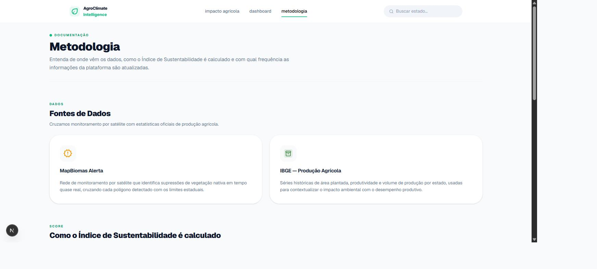

# 🌱 AgroClimate Intelligence

Painel de inteligência agroclimática que cruza **alertas de desmatamento em tempo quase real (MapBiomas)** com **estatísticas oficiais de produção agrícola (IBGE)** para gerar um índice de sustentabilidade por estado brasileiro.


## Sobre o projeto

O agronegócio brasileiro precisa equilibrar produtividade com preservação ambiental. O **AgroClimate Intelligence** existe para tornar esse equilíbrio visível: cruza dois conjuntos de dados públicos — alertas de supressão de vegetação nativa via satélite e séries históricas de produção agrícola — e calcula, para o Brasil e para cada estado, um **Índice de Sustentabilidade de 0 a 100**.

O projeto foi construído como peça de portfólio, com foco em:

- **Arquitetura limpa**: componentes pequenos e com responsabilidade única, camada de serviços isolada da UI, tipos compartilhados.
- **Resiliência de dados**: toda chamada a API externa tem fallback (cache em memória + dados de contingência), então a UI nunca quebra por instabilidade de terceiros.
- **Acessibilidade**: navegação por teclado e atributos ARIA no combobox de busca, estados de loading/empty tratados explicitamente.
- **Segurança**: o token da API do MapBiomas nunca chega ao cliente — fica isolado num Route Handler que expõe apenas a query esperada, evitando que a rota vire um proxy aberto.

## Capturas de tela

| Impacto Agrícola | Dashboard |
| :---: | :---: |
|  |  |

| Ranking de Estados | Metodologia |
| :---: | :---: |
|  |  |

## Funcionalidades

- **Mapa interativo do Brasil** (SVG) com pressão ambiental por estado — clique num estado para filtrar todo o painel por ele.
- **Índice de Sustentabilidade** (0–100) calculado a partir do volume e da intensidade dos alertas de desmatamento de uma região.
- **Dashboard de produção agrícola**: produção total, área plantada, distribuição por estado (donut chart) e histórico de safras (2019–2023), com dados reais da API SIDRA/IBGE.
- **Ranking de estados** por volume de produção e por área sob alerta ambiental.
- **Busca de estados** no header, com autocomplete, navegação por teclado (↑ ↓ Enter Esc) e suporte a leitores de tela.
- **Página de metodologia**, documentando as fontes de dados e a fórmula do score para transparência.
- **Fallbacks graciosos** em todas as chamadas de API: se o IBGE ou o MapBiomas estiverem fora do ar, a interface exibe dados de contingência em vez de quebrar.

## Como o Índice de Sustentabilidade é calculado

```
score = 100 − (nº de alertas × 0.5 + √área_total_ha × 0.8)
```

Quanto mais alertas ativos e maior a área total afetada em uma região, maior a penalidade — a raiz quadrada evita que um único evento muito grande distorça o índice. Detalhes completos em [`/metodologia`](app/metodologia/page.tsx).

## Stack técnica

| Camada | Tecnologia |
| --- | --- |
| Framework | [Next.js 15](https://nextjs.org/) (App Router) |
| UI | [React 19](https://react.dev/) + [TypeScript](https://www.typescriptlang.org/) |
| Estilo | [Tailwind CSS v4](https://tailwindcss.com/) + [tw-animate-css](https://github.com/Wombosvideo/tw-animate-css) |
| Gráficos | [Recharts](https://recharts.org/) |
| Ícones | [Lucide](https://lucide.dev/) |
| HTTP | [Axios](https://axios-http.com/) |
| Dados | [API SIDRA/IBGE](https://sidra.ibge.gov.br/) · [Localidades IBGE](https://servicodados.ibge.gov.br/api/docs/localidades) · [MapBiomas Alerta](https://plataforma.alerta.mapbiomas.org/) |

## Arquitetura

```
app/
├── api/mapbiomas/route.ts     # Route Handler — único ponto que conhece o token do MapBiomas
├── components/layout/         # Header com busca de estados (combobox acessível)
├── dashboard/                 # Página de produção agrícola (métricas, gráficos, ranking)
├── impactoAgricola/           # Página principal (mapa, score, alertas em tempo real)
├── metodologia/                # Documentação pública das fontes de dados e do score
├── services/                  # Camada de acesso a dados: ibge.ts, mapbiomas.ts, api.ts
├── constants.ts                # Mapeamento sigla ↔ nome de estado, usado em toda a app
└── mapData.ts                  # Paths SVG do mapa do Brasil por estado
```

Cada página segue o mesmo padrão: um componente de conteúdo `"use client"` dentro de um `<Suspense>` com skeleton próprio, delegando toda a busca de dados para `app/services/*` — os componentes de UI nunca fazem `fetch` diretamente.

## Rodando localmente

### Pré-requisitos

- Node.js 18.18 ou superior
- Um token de API do [MapBiomas Alerta](https://plataforma.alerta.mapbiomas.org/) (gratuito, requer cadastro)

### Setup

```bash
git clone <url-do-seu-fork>
cd agro-climate-intelligence
npm install
cp .env.example .env.local
# edite .env.local e adicione seu MAPBIOMAS_TOKEN
npm run dev
```

Abra [http://localhost:3000](http://localhost:3000).

> Sem o token do MapBiomas configurado, a seção de alertas ambientais fica vazia — o resto da aplicação (dashboard de produção agrícola, mapa, busca) funciona normalmente, pois depende apenas de APIs públicas do IBGE.

### Scripts disponíveis

| Comando | Descrição |
| --- | --- |
| `npm run dev` | Sobe o servidor de desenvolvimento |
| `npm run build` | Build de produção |
| `npm run start` | Sobe o build de produção |
| `npm run lint` | Roda o ESLint |

## Limitações conhecidas

- Alertas do MapBiomas podem atrasar em dias de alta cobertura de nuvens (limitação da própria fonte de satélite).
- O índice é um indicador comparativo, não uma certificação ambiental oficial.
- Algumas dependências de desenvolvimento do próprio Next.js (otimização de imagem) carregam avisos de segurança transitivos no `npm audit` que só serão resolvidos em um bump de major version do framework — não afetam o código da aplicação.

## Licença

Distribuído sob a licença [MIT](LICENSE).

---

Desenvolvido por **Beatriz Araújo**.
